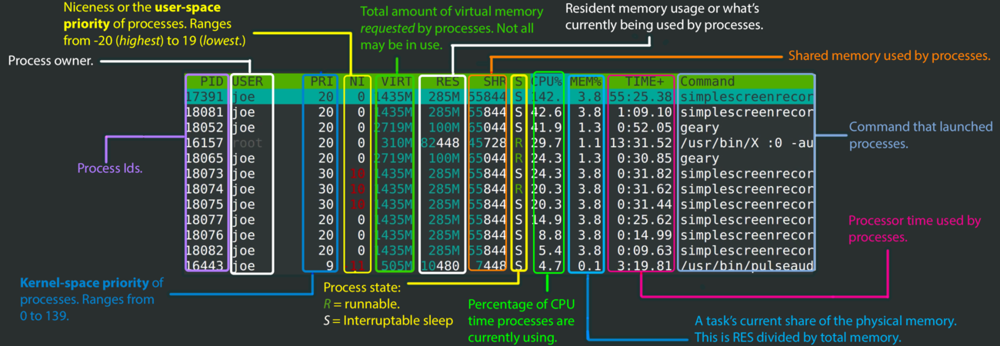

# Software Optimization

Software Analysis, Debug and Optimization

* [Software optimization resources](https://www.agner.org/optimize/)
* [Programming Optimization](http://www.azillionmonkeys.com/qed/optimize.html)
* [Making Your C++ Code Robust](https://www.codeproject.com/articles/216077/making-your-cplusplus-code-robust)
* [Debuggers and Debugging Techniques](https://www.cprogramming.com/debugging/)

-----

[TOC]


## Compiler Optimization Options

* [GCC optimization](https://wiki.gentoo.org/wiki/GCC_optimization)
* [Optimization in GCC](https://www.linuxjournal.com/article/7269)
* [GCC compiler optimization for ARM-based systems](https://gist.github.com/fm4dd/c663217935dc17f0fc73c9c81b0aa845)
* [10 useful tips for using the floating point unit on the Cortex-M4](https://community.arm.com/processors/b/blog/posts/10-useful-tips-to-using-the-floating-point-unit-on-the-arm-cortex--m4-processor)


## Analysis

### [htop](http://hisham.hm/htop/) - an interactive process viewer for Unix

* [htop explained](https://peteris.rocks/blog/htop/) - Explanation of everything you can see in htop/top on Linux




### Cppcheck - a static analysis tool for C/C++ code
[Cppcheck](http://cppcheck.sourceforge.net/) provides unique code analysis to detect bugs and focuses on detecting undefined behaviour and dangerous coding constructs. The goal is to detect only real errors in the code (i.e. have very few false positives).
```
cppcheck --enable=all src/
```

### Valgrind - a dynamic analysis tools
[Valgrind](http://valgrind.org/) is an instrumentation framework for building dynamic analysis tools. There are Valgrind tools that can **automatically detect many memory management and threading bugs, and profile your programs in detail**. You can also use Valgrind to build new tools.
```
valgrind --tool=memcheck --leak-check=full <program args>
```

### gprof and gcov

[gprof and gcov](https://alex.dzyoba.com/blog/gprof-gcov/) are classical profilers that are still in use. Since the dawn of time, they were used by hackers to gain insight into their programs at the source code level.

* **[gprof](https://sourceware.org/binutils/docs/gprof/) (GNU Profiler)** – simple and easy profiler that can show how much time your program spends in routines in percents and seconds. gprof uses source code instrumentation by inserting special mcount function call to gather metrics of your program.
```
gprof <program_name> gmon.out
```

* **[gcov](https://gcc.gnu.org/onlinedocs/gcc/Gcov.html) (short for GNU Coverage)** is a tool you can use in conjunction with GCC to test code coverage in your programs. Usually it’s used in pair with gprof to understand what exact line in slacking function is holds your program down.
```
gcov -b *.gcno
```

* [cpp-coveralls](https://github.com/eddyxu/cpp-coveralls) - Upload C/C++ coverage report to coveralls.io


## Test

### [GTest](https://github.com/google/googletest) - Google C++ Testing Framework
* [Getting started with Google Test (GTest) on Ubuntu](https://www.eriksmistad.no/getting-started-with-google-test-on-ubuntu/)
* [玩转Google开源C++单元测试框架Google Test系列(gtest)(总)](http://www.cnblogs.com/coderzh/archive/2009/04/06/1426755.html)


## Debug

* dmesg
* readelf
* strace
* addr2line
* nm
* strip
* [Backward-cpp](https://github.com/bombela/backward-cpp): a beautiful stack trace pretty printer for C++

### GDB
* [GDB - Debugging stripped binaries](https://felix.abecassis.me/2012/08/gdb-debugging-stripped-binaries/)


## Others
* for循环
  - 重点优化计算量大的for循环
* 内存
  - 减少内存的重复开辟
* 使用std::vector
  - 调用push_back前，使用reserve方法预分配内存
  - 使用resize方法初始化vector，再使用=赋值
* 查表法
  - 一些函数可以用查表法线性近似，必要时还可以动底层的数学计算库
